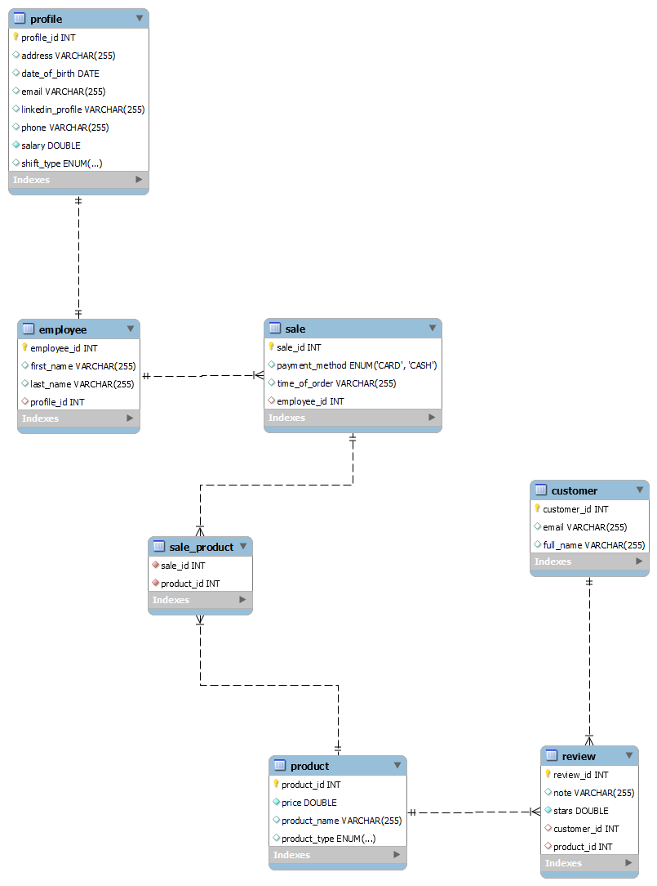

# Web Application Programming in Java

## FINAL PROJECT

> Name of the Project: **Coffee Shop**
> 
> Student: Duță Flavia
> 
> Domeniul: Inginerie Software
> 
> Grupa: 406
> 
> Facultate de Matematica si Informatica, Universitatea din Bucuresti

_Cerință_

Un tânăr antreprenor a deschis o cafea. Acesta dorește să aibă o bază de date a cafenelei cu toate informațiile relevante despre afacerea sa. Se știe că în cafenea există angajați care lucrează. Pentru fiecare angajat ne interesează să avem în baza de date un profil cu detalii despre aceștia. 

La cafenea vin zilnic clienți care plasează comenzi. Atunci când plasează o comandă, clientul scanează un cod QR unde vede meniul. Pe lângă meniu, are opțiunea de a completa un formular cu mai multe câmpuri, printre care și emailul personal astfel încât să poată primi oferte speciale. 

Fiecare comandă conține unul sau mai multe produse. Despre un anumit produs din meniu ne interesează să cunoaștem câteva detalii, precum denumire și preț. Un client poate lăsa o recenzie în care să dea o notă unui produs și să scrie o scurtă descrie despre experiența sa.

Entități (6):

- EMPLOYEE
- PROFILE
- SALE
- COFFEE
- CLIENT
- REVIEW

## Business Requirements

🔵 Get all the employees that work a certain shift type

🔵 Get the average salary of an employee

🔵 Get all the employees that have the salary above a given value

🔵 Get all employees who have not placed any order

🔵 Delete the employees that works a seasonal shift

🔴 Create an order 

🔴 Get the total price of an order 

🔴 Get all the orders that contains a certain product by product id 

🔴 Find that orders taken by a certain employee given by employee id 

🟣 Get all the products ordered in a certain period given by 2 dates

🟣 Get products who have not received any review yet

🟣 Get all the products sorted asc/ desc by price

🟣 Update the price of a product given by product id during exam session by applying a discount of 25%

🟢 Retrieve average rating and count the reviews for each product

🟢 Get all the reviews of a product given by product id

🟡 Get the customers that submitted reviews for a certain product given by product id 

### The main features

| Feature                                                              | Description                                                                                                                                                                                                                                                               |
|----------------------------------------------------------------------|---------------------------------------------------------------------------------------------------------------------------------------------------------------------------------------------------------------------------------------------------------------------------|
| Create an order                                                      | Create an order that contains the payment method, the id of the employee that took the order, the list of products and the time when the oder was placed will be automatically set to the current time. The list of products can contains many products of the same type. |
| Get the employees with zero order                                    | Retrieve the list of employees that didn't take any order, meaning their ids was not found in any order.                                                                                                                                                                  |
| Update the price of a product given during exam session | Knowing the exam session for this period is between 2014-01-19 and 2024-02-11, update only the price of a product given by product id by applying a discount of 25% during the specified period.                                                                          |
| Delete the employees that works a seasonal shift                     | During summer, many employees who work a seasonal shift come to the coffee shop. After September, they resign and must be removed from the database, along with their profile.                                                                                            |
| Get the orders that contains a certain product                    | Get a list of all order ids that contain a specific product given by product id.                                                                                                                                                                                          |

Swagger Documentation can be accessed at this [link](http://localhost:8080/swagger-ui/index.html) when the application is running.